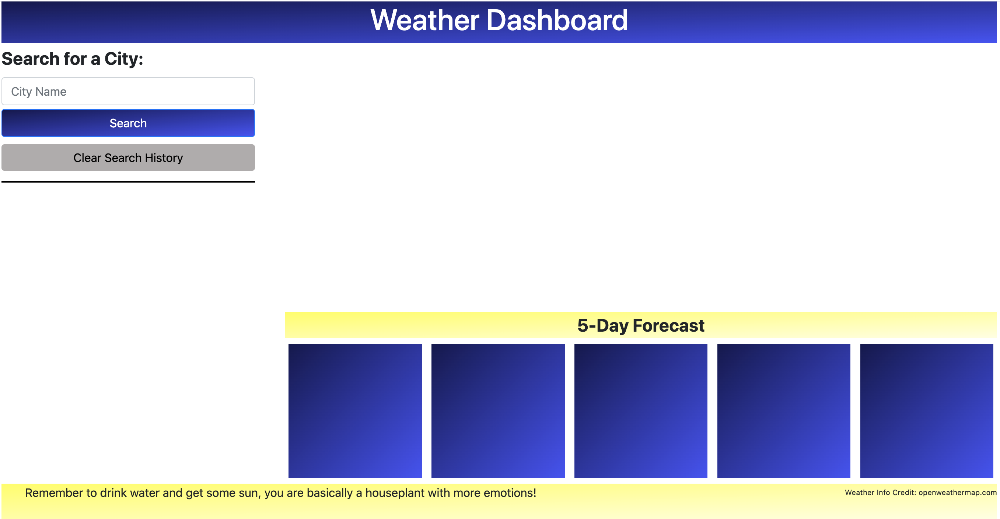
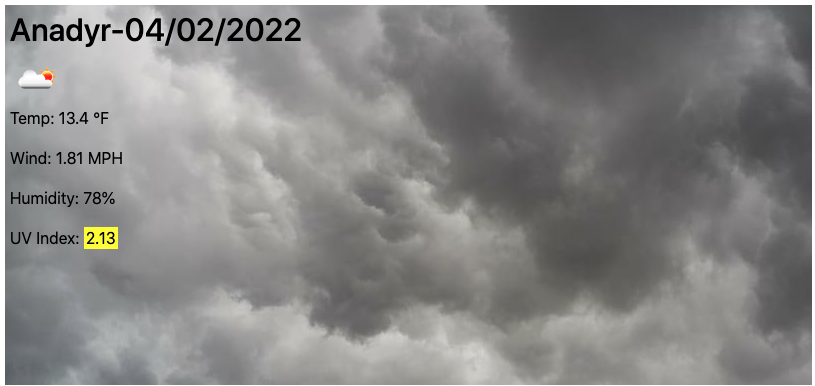
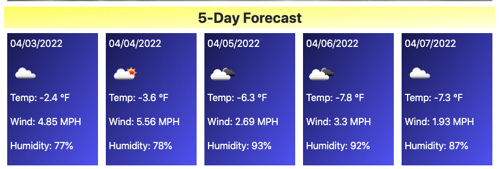

## Weather Dashboard - Homework 6

## Table of Contents
- [Application](#Application)
- [HTML Layout](#html)
- [CSS Grid](#css)
- [Javascript](#)
- [Tests](#tests)
- [Link](#link)

## Application

The user story highlighted a traveler that wants to see the weather forecast for multiple to assist travel planning. The acceptance criteria included a page load that presents a weather dashboard with form inputs. The search input for a city should present the current and future conditions within that city as well as add the city to the search history. When viewing the current weather conditions the user should be presented with the city name, the date, an icon weather representation, the temperature, humidity, wind speed and UV index. The UV index should be color coded based on a favorable, moderate, or severe value. The future weather should be presented as a 5-day forecase that displays the date, an icon representation of the weather, the temperature, wind speed, and humidity. Finally, when the city is clicked on in the search history then the browser should present the weather again. 

## HTML

To create the initial layout of the page, I created a container to hold all of the page content so I could format it with a CSS grid. Within the container I held the header, the sidebar, the current weather container, five containers for the 5-day forecast and a footer. Within the sidebar I created the search input field where the user could type in a city name. Above the input field sits a label and asked the user to search for a city. Below the input field sits a submit button and a clear search history button that will clear any buttons created throughout the searches. Below the search history button lies an initially empty container that will hold the search history buttons as the user interacts with the page. Then I placed a spot for the current weather with two sections for the header of the current weather and the weather content. Then I added a section divider to label the 5-day forecast and added five different holders for five-day weather content. Finally, I added a footer to hold a fun quote and credit the openweathermap.com API source. 

## CSS

The CSS holds all of the color and styling for the page as well as creates the grid layout of the page. After drawing up the different portions of the page I determined there were 5 rows and 6 columns so I laid out the grid as such, applying different grid areas to different portions of the HTML. I formatted all the different background color gradients, font sizes and colors, as well as any necessary padding/margins/borders to create the desired layout that appears when there is no content on the page. 



I also created three different classes that could added within the javascript file for the uv-index based on severity values (uv-good, uv-okay, and uv-bad). Finally, I created a media screen that changes the CSS grid to a 1 column, 10 row layout when the screen is smaller than 550px. 

## Javascript

> **Submit Button Handler** 

After creating event handlers for different elements within the HTML, I started with a function to handle the submit button click. The submit button handler function starts by pulling any cities stored in local storage from previous searches and storing them as an array that new cities can be pushed onto when searched. Then the text entered in the input field is grabbed and split up to confirm that the first letter in each word is capitalized. Once the city string is formatted, if it is not already part of the array created from local storage, it is added to the end of the array and populated as a button in the search history container for later use. If the city is already part of the search history then an alert box appears that notifies the user. The new array is stored in local storage and the header as well as get weather function, to call both APIs, are called using the new city name. 

> **Search History Button Handler**

I applied an event listener to the new created search history buttons by adding an event listener to the container that holds the buttons and then targeting the mouse click to pull the data attribute that I assigned to the button, when it was created, equal to the city name. The city name is then used to create the header and run the get weather function to call both APIs. 

> **Get Weather Function**

The getWeather function passes a city name through to call the first geocoding API to get the latitude and longitude of the city. The city name is used as a query parameter in the first API call. I stored the latitude and longitude as variables and then used them in the return function to call the second API call. The return function prior to the second API call allowed me to ensure the first API finished before calling the second one since the first is required for the second one, which would not bode well with the asychronous nature of javascript. Once the data is acquired from the second API call, using the lat/long, then the display current weather and display five day forecast functions are called using the gathered data to populate the today and fiveday weather containers. 

> **Create Main Header Function**

The createMainHeader function uses the city name to populate a new header at the top of the current weather container. It starts by clearing out the current header, then pulls the city name from the input field and capitalizes the first letter of each word. I also pulled the current date using moment. Then I created a header with the text content of the city name and the date from moment. That text content is appended to the header container. Finally, I emptied the input field.

> **Display Current Weather Function**

The displayCurrentWeather function starts by emptying out any weather currently displayed in the today card container. Then it confirms there is a repository to pull data from by checking the length of the object. If the object is empty then it notifies the user that no data was found by displaying "No respositories found - please check your sity name". If a data is found then it creates variables to old the information needed including the weather icon, temperature, wind speed, humidity, and uv index. I create elements to hold each of these variables and fill the text content of each elements with the variables I created. I also applied a conditional to the uv index to apply a different class based on the numerical value of the uvIndex variable to color-code the severity. I also added a background image for generic weather occurences including clouds, clear/sun, snow, and rain. If none of those weather conditions were present in the city searched then the background turned lightgrey to display the current weather. Finally, I appended all the new elements to the today card content container. 



> **Display Five Day Forecast Function**

The displayFiveDayForecast function starts out by clearing out each of the 5 sections to prep for new data. Just like the current weather function, first it checks the length of the object found in the API call to confirm it isn't empty. Then it loops through the "daily" portion of the object fetched by the API starting at index 1, because index 0 is the current weather already displayed in the card above, and finishing at index 6 to give 5 days of data. The date for each day is populated by adding the index number to the current day using moment. Then, just like the current weather function, I created variables to hold all the necessary information, elements to hold that information, applied the text content to each of the elements using the variables, and then appended the children to each second of the 5 days. 



> **Window Reload & Clearing History**

Upon page reload, I pull the cities from local storage and create history button with the city names within the search history container. I also added a "Clear Search History" button to allow the user to clear out the search history buttons by clearing local storage and reloading the page.

## Tests

To test the application, I took the list of acceptance criteria and went through the page to confirm that I met each of the criteria. 
```
GIVEN a weather dashboard with form inputs
WHEN I search for a city
THEN I am presented with current and future conditions for that city and that city is added to the search history
WHEN I view current weather conditions for that city
THEN I am presented with the city name, the date, an icon representation of weather conditions, the temperature, the humidity, the wind speed, and the UV index
WHEN I view the UV index
THEN I am presented with a color that indicates whether the conditions are favorable, moderate, or severe
WHEN I view future weather conditions for that city
THEN I am presented with a 5-day forecast that displays the date, an icon representation of weather conditions, the temperature, the wind speed, and the humidity
WHEN I click on a city in the search history
THEN I am again presented with current and future conditions for that city
```


## Link

See the following for a link to my deployed application: http://nbulger1.github.io/weather-dashboard/

I ran into an issue, once published, that the geocoding API URL uses "http" instead of "https" which through a mixed content error in the deployed page unless I changed the URL from "https://nbulger1..." to "http://nbulger1...". Once the URL was changed then it returned to the function I was expecting. This error seems to be gone now with either URL, but leaving this note here just in case it happens again. 